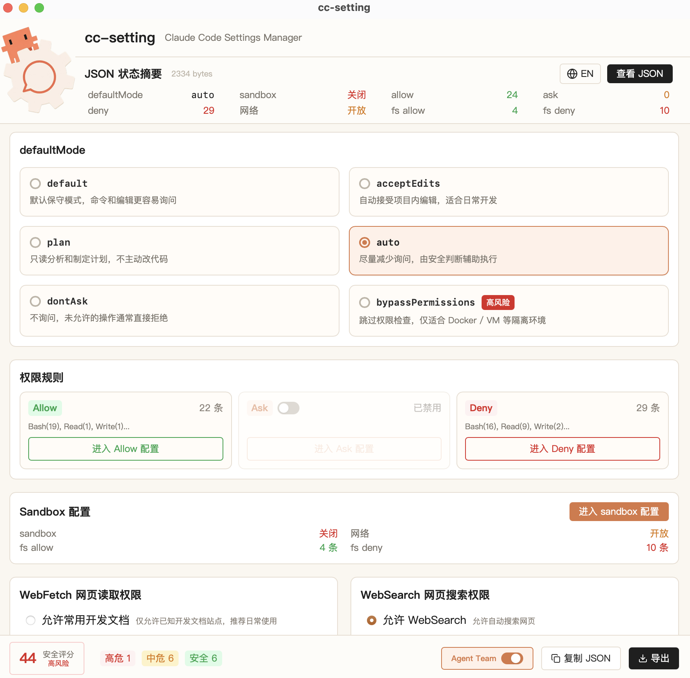

<p align="center">
  
</p>

<p align="center">
  <strong>ZH</strong> / <a href="./READMEEN.md">EN</a>
</p>

## 界面预览

<p align="center">
  
</p>

## 功能

- **Permissions**：Bash、Read、Edit、Write、WebFetch、WebSearch 等工具的 allow / ask / deny 三级权限
- **Sandbox**：文件系统白名单、网络白名单
- **WebFetch**：禁用 / 开发文档白名单 / 全部开放 / 自定义域名
- **Agent Team**：实验性多会话 Agent 协调功能
- **Profile 预设**：safe、dev-net、strict、custom 一键切换
- **JSON 预览**：CodeMirror 编辑器，实时同步
- **安全评分**：实时计算配置安全分数，标注风险项
- **备份恢复**：写入前自动备份，一键恢复

## 技术栈

React 19 + TypeScript + Vite 6 + Tailwind CSS + Rust (Tauri 2)

## 使用教程

### 1. 前置环境

在运行或构建 CC-Setting 前，需要先安装以下环境：

#### 1.1 Node.js

本项目使用 Node.js 进行前端依赖管理与构建。建议安装 LTS 版本。

安装完成后验证：

```bash
node -v
npm -v
```

官方下载：<https://nodejs.org/en/download>

#### 1.2 Rust

Tauri 后端使用 Rust 编写，需要安装 Rust 工具链。

```bash
curl --proto '=https' --tlsv1.2 -sSf https://sh.rustup.rs | sh
```

安装完成后验证：

```bash
rustc --version
cargo --version
```

官方文档：<https://www.rust-lang.org/tools/install>

### 2. 获取源码

```bash
git clone https://github.com/Luzer-Chen/CC-Setting.git
cd CC-Setting
```

### 3. 安装依赖

```bash
npm install
```

### 4. 启动开发模式

```bash
npm run tauri dev
```

首次启动会自动下载 Rust 依赖并编译，耗时较长。之后启动会使用缓存，速度较快。

### 5. 构建 macOS .app

```bash
npm run tauri build
```

构建产物位置：

```text
src-tauri/target/release/bundle/macos/cc-setting.app
src-tauri/target/release/bundle/dmg/cc-setting_1.1.0_aarch64.dmg
```

### 6. 构建 Windows .exe

在 Windows 系统上执行：

```bash
npm run tauri build
```

构建产物位置：

```text
src-tauri/target/release/bundle/nsis/cc-setting_1.1.0_x64-setup.exe
```

> 也可以通过 [Releases](https://github.com/Luzer-Chen/CC-Setting/releases/latest) 页面下载预构建的安装包。

## 开发

```bash
npm install
npm run tauri dev
```

## 构建

```bash
npm run tauri build
```

## License

[MIT](LICENSE)
