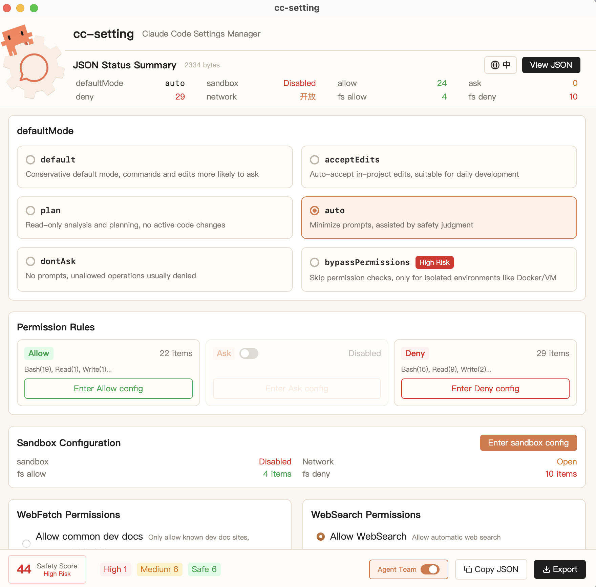

<p align="center">
  
</p>

<p align="center">
  <a href="./README.md">ZH</a> / <strong>EN</strong>
</p>

## Demo

A preview of the CC-Setting desktop interface.

<p align="center">
  
</p>

## Features

- **Permissions**: allow / ask / deny for Bash, Read, Edit, Write, WebFetch, WebSearch and more
- **Sandbox**: filesystem allow/deny, network whitelist
- **WebFetch**: disabled / dev docs whitelist / fully open / custom domains
- **Agent Team**: experimental multi-session agent coordination
- **Profiles**: safe, dev-net, strict, custom — one-click switch
- **JSON Preview**: CodeMirror editor, real-time sync
- **Security Scoring**: real-time safety score with risk highlighting
- **Backup & Restore**: auto-backup before write, one-click restore

## Tech Stack

React 19 + TypeScript + Vite 6 + Tailwind CSS + Rust (Tauri 2)

## Download

[Releases](https://github.com/Luzer-Chen/CC-Setting/releases/latest) — macOS `.app` / Windows `.exe`

## Development

```bash
npm install
npm run tauri dev
```

## Build

```bash
npm run tauri build
```

## License

[MIT](LICENSE)
